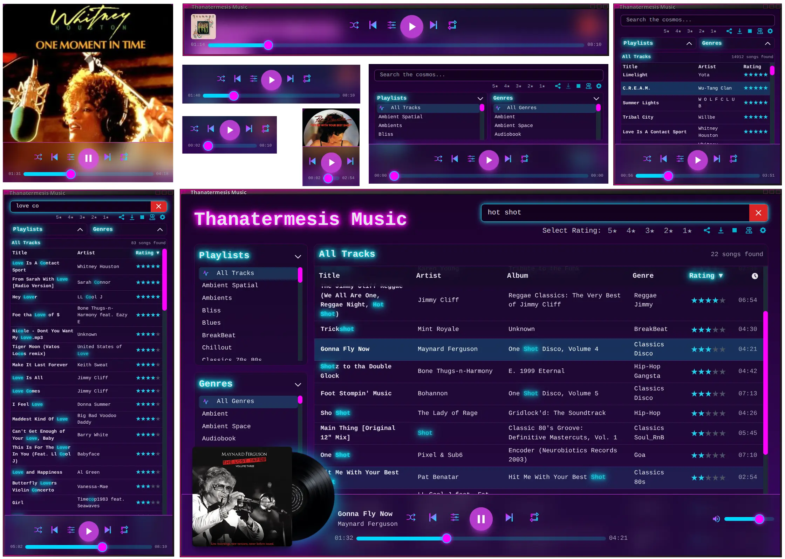
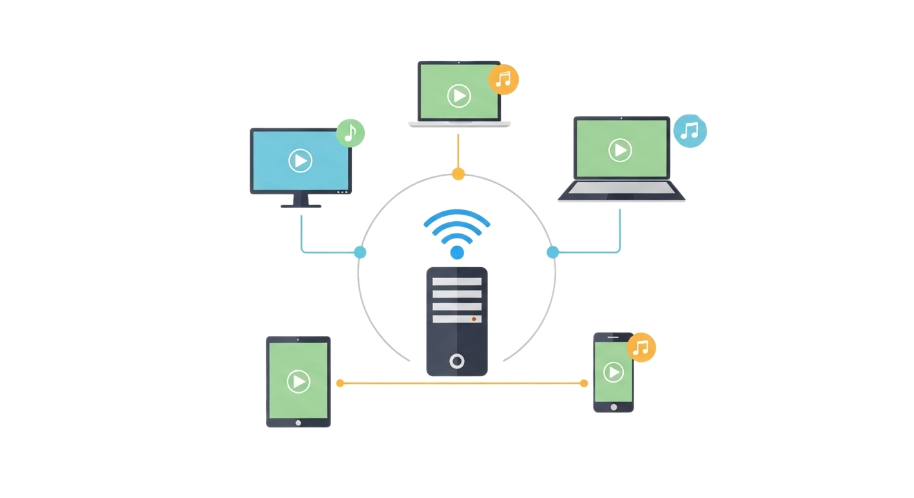

# Synthwave Player


Simply put, this is the **most enjoyable** music player ever made.

It is a self-hosted, open-source, web-based music _(WIP and video)_ player application that streams your local music library with a beautiful synthwave / retrowave / outrun / neon-style aesthetic. Using your music collection to be a private streaming service or just a personal player, giving you complete control over your listening experience without distractions.

<!-- Intro Image -->


<!-- [](https://www.youtube.com/watch?v=YOUTUBE_VIDEO_ID_HERE "Synthwave Player - Video Demo") -->
<!--  -->

<!-- **[➡️ Demo Website](https://music.home.thanatermesis.org/?genres=Synthwave%2CSynthwave+Vocal&song=2f0f940b8d019f2f2a2271317a01ae99efadb44e&sort=rating%3Adesc&t=54)** -->
**[➡️ Demo Website](https://music.home.thanatermesis.org/?playlists=Royalty-Free&song=24350eb10ec99665d6444bb294983d2998e363a4&sort=rating%3Adesc&t=77)**

**[📜 Changelog - See all the history changes](CHANGELOG.md)**


## A Sonic Universe Under Your Control

<!--  -->

Tired of streaming services that dictate your listening experience, inject ads, and rent you access to music you thought you owned? The **Synthwave Player** is a declaration of musical independence a real music freedom.

It's not a service; it's ***your*** **open-source server**, it's your music and your curation, it's your unstoppable own power.


Built for the discerning music lover who curates their own library, this player combines the convenience of a web interface access with the power of hosting your own music. It streams your local music directly to any browser, on any device, wrapped in a gorgeous, retro-futuristic synthwave aesthetic.

<br clear="right">

### Why is it Better?

Unlike desktop apps lacking a good experience or restrictive streaming platforms, this player is built with a different philosophy:

-   **👑 Total Ownership:** Your music, your rules. No subscriptions, no ads, no internet dependency for your files. De-cloud yourself and own your best listening experience, exactly as you want it.
-   **🎧 Your Personal Spotify:** Transform your music library into a private streaming service. Get the Spotify experience with your own collection, no ads, no fees, no surprises, and complete privacy. - Is time to cancel your Spotify billing!
-   **🎨 Beautiful Design & Unique UX:** Music is a sensorial experience, so this player offers a beautifully crafted synthwave-inspired interface and a unique user experience designed to immerse you in the music with the sole purpose to enjoy it.
-   **🔭 View-Based Tracklists:** Features a powerful view-based tracklist selection. Any view you create by filtering genres, combining playlists, or search results becomes a unique, perfectly shareable tracklist.
-   **🧩 Seamless Rhythmbox Sync:** It leverages your existing, meticulously curated Rhythmbox library out of the box. All your songs, ratings, and playlists are available instantly with zero configuration.
-   **🚀 Access Anywhere:** With automatic **UPnP** configuration, your own music cloud is effortlessly available wherever you have an internet connection. No complex network setup required.
-   **🔗 Unmatched Sharability:** Share not just songs, but *moments*. Send a link to a track that starts at the exact second you want, or share a link to your custom-filtered 5-star 80s rock playlist.


<details>
    <summary>
        <strong>Why this Self-Hosted Player 🏆 Beats Spotify for Music Lovers👈 </strong>
    </summary>
    <br>

For real collectors of good music, synthwave lovers, seekers or of original masterpieces, a self-hosted player isn't just a preference, it's a necessity. Here’s why streaming services like Spotify fall short for the dedicated music enthusiast:

-   **🎵 The Unfindable Tracks:** Mainstream services lack the deep cuts. Obscure B-sides, rare Japanese imports, fan-made remixes, and entire video game OSTs are very often missing from their libraries. With a self-hosted player, if you have the file, you can play it. Your collection is limited only by what you can find, not by what a corporation dictates.

-   **🎤 For Music Creators:** Are you a musician or composer? This platform can become your own record label. Publish your works-in-progress or finished masterpieces directly to your server, share them with fans, and bypass the corporate gatekeepers of the music industry dictatorship. You control the distribution, you own the rights, and you're not bound by any platform's rules.

-   **💿 The Original Masters:** Streaming platforms frequently replace original album versions with modern "remasters", which can alter the classic sound you fell in love with. Self-hosting your music gives you full control over the specific version and mastering of each track, preserving the authentic experience you want to have.

-   **🏷️ Your Curation:** Are you tired of seeing your meticulously tagged "Vaporwave" tracks lumped into a generic "Electronic" category? On Spotify, you're stuck with their metadata. Here you control the tags, genres, ratings, and cover art. You can build the perfectly organized music library you've always wanted and that nobody else can offer you.

-   **👻 No Vanishing Music:** Tracks and albums on streaming services can disappear overnight due to expired licensing agreements. Your personal, self-hosted library is permanent. Your favorite songs will never be pulled from your collection.

-   **🔊 Uncompromised Audio Quality:** Many collectors prefer lossless formats like FLAC to preserve the full quality of their music. While some streaming services offer higher tiers for this, a self-hosted player lets you stream your high-fidelity files without compromise or extra cost.

-   **✨ The Full Aesthetic Experience:** A generic, modern UI can't capture the spirit of the enjoyable music. The Synthwave Player is designed to immerse you in the neon-drenched, world of dreams to elevate your experience. Because it's not just about listening, it's about the vibe. Spotify sells you music, this player gives you a time machine to change the history.

</details>

---

## Features

### 🎵 Your Music, Everywhere

Stream your entire music library to any device with a web browser, whether you're at home or on the go. The responsive design works beautifully on desktops, laptops, tablets, and phones.


### 📦 Zero-Setup, and with Rhythmbox Integration
-   Automatically discovers and parses your existing `rhythmdb.xml` database, so you can continue managing your music within Rhythmbox and share all from this player.
-   Instantly loads all your songs, metadata, and star ratings, and builds a **completely organized list** from your entire library.
-   Imports your `.pls` playlists if you have, radio stations, etc

### ⚡️ Blazing-Fast Fuzzy Results
_when you remember that the song contains "summer" as title and the artist is trevor-something, but you can't remember more than that?_
-   The house-made, builtin smart fuzzy matching finds what you're looking for, even with typos or partial words.
-   Find any track, artist, or album in milliseconds with an as-you-type search, faster than selecting lists manually.
-   Search results can be further filtered and sorted just like any other view.

### 🎨 Stunning Synthwave & Retrowave UI
-   A beautiful, responsive and adjustable interface with a neon-style, retro-futuristic aesthetic, so enjoyable that it should be forbidden in every country from this world and other ones.
-   **Dynamic Visualizer:** When a song with cover art plays, the album cover slides out to reveal a spinning vinyl disc with a subtle, cycling neon glow.

https://github.com/user-attachments/assets/c422dc7f-b973-452b-8cc1-ce991e1a2b6a

_View fullscreen cover art for any song with a single click or from the menu, so you can leave the player running like that._

### 🎛️ Powerful Filtering & Sorting
-   Create on-the-fly views by combining filters for **multiple genres**, **multiple playlists**, and **star ratings**. Mix and match to create the perfect soundscape, for example, instantly viewing all your 5-star songs from your "Rock" and "80s" playlists combined that contain the keyword "night".
-   Sort your music by title, artist, album, genre, rating, or duration.
-   The player state is stored in the URL, so you can bookmark and share your exact view, filters, sorting, and all.

### 🔗 Hyper-Specific Sharing
-   Share a direct link to any **song**.
-   Share a song that starts at a specific **timestamp** (e.g., `...&t=125`).
-   Share links to custom views, including combinations of **multiple playlists**, **multiple genres**, rating filters, sorting, and even search queries.
-   One-click sharing of the current song to **X**, **Facebook**, **WhatsApp**, and **Telegram**.

### 🎧 Full-Featured Playback
-   All the controls you expect: Play, Pause, Next, Previous, plus a dedicated **Stop** button to clear the current view and filters.
-   **Smart `Previous` Button:** Restarts the current song if you're more than a few seconds in (configurable), otherwise plays the previous track.
-   **Two Shuffle Modes:** "List" shuffle creates a randomized but stable playlist from your current view, while "Random" shuffle picks a completely new random song each time.
-   **Repeat modes:** Repeat All, Repeat One, or Off.
-   **Playback Speed Control:** Adjust playback speed on the fly with pitch preservation, perfect for listening the podcasts or audiobooks at your own pace.
-   **Power-User Shortcuts:** Use your mouse wheel over the progress and volume bars to seek and adjust levels. Right-click on elements throughout the player to access powerful context menus.

### 📥 Easy Downloads & Menus
-   Download any song directly when playing it with a single click. No need to trick a download!
-   A powerful right-click **context menu** on songs, playlists, and genres provides quick access to actions like sharing (songs, playlists, views), downloading, viewing cover art, and opening lists in a new tab.
-   Settings to enable/disable features like cover art, crossfade duration, columns, etc.

### 🌐 Automatic Network Configuration
Built-in **UPnP** support that automatically configure your required port forwarding on your router, making your music accessible from the internet with zero hassle.

### 🚀 High-Performance & Lightweight
-   **High-Performance Streaming:** Built on the robust Mojolicious framework, the player uses a non-blocking (asynchronous) architecture to handle hundreds of simultaneous connections and streams with minimal resource usage.
-   **Lightweight & Self-Contained:** The server is incredibly lightweight, capable of running with as little as 50MB of RAM. The entire application is a 🤯 **single file** 🤯, designed to be lean, fast, and easy to run.
-   **Scales to Massive Libraries:** For even the largest libraries, the player shows a progress bar while loading and then intelligently renders songs in batches as you scroll. This keeps the interface snappy, no matter if you have a few hundred songs or tens of thousands.

### 🔒 Private & Secure
You host it yourself. There is no tracking, no data collection, and no third-party servers are involved. It's just you and your music. Let's get back to the roots of the internet, a world without commercial interest, with our freedom and privacy. Like in the old times, but now with super powers.

---

## Getting Started

**NOTE:** If you just want to try the player 🚀 the quickest method is to simply download **[Elive Retrowave](https://www.elivecd.org/download/retrowave)** which ships with the player already pre-installed, configured, and with music ready to use.

<details>
<summary>
        <strong>Manual Installation</strong>
        
    </summary>
### Installation

1.  **Clone the repository**:

2.  **Install the required Perl modules.**

    You can use `cpanm` (you might need to install it first, e.g., `sudo apt-get install cpanminus`):
    ```bash
    sudo cpanm Mojolicious Net::UPnP XML::LibXML MP3::Tag File::HomeDir Digest::SHA Try::Tiny
    ```

    **Alternatively, for Debian 13 (Trixie) and derivatives:**
    You can install most dependencies directly from the system's package manager, which is often faster and better integrated.
    ```bash
    sudo apt-get update
    sudo apt-get install libmojolicious-perl libnet-upnp-perl libxml-libxml-perl libmp3-tag-perl libfile-homedir-perl libdigest-sha-perl libtry-tiny-perl
    ```

3.  **Make the script executable:**
    ```bash
    chmod +x synthwave-player
    ```

### Running the Server
There are several ways to run the player. For initial testing, it's best to run it in the foreground to watch for logs and errors.

**1. Foreground Mode (for testing)**
To see live log output, run the server in the foreground. It will run until you stop it with `Ctrl+C`.
```bash
hypnotoad --foreground synthwave-player
```

**2. Background Daemon Mode**
To start the player and have it run in the background, detached from your terminal:
```bash
hypnotoad synthwave-player
```
To stop the background server:
```bash
hypnotoad --stop synthwave-player
```

### Accessing the Player
Open your web browser and navigate to `http://<your-server-ip>:8160` as it explains on the terminal logs. If running on your local machine, you can simply use `http://localhost:8160` or `http://127.0.0.1:8160`.

#### 📱 Using as a Desktop App
For a more integrated desktop experience, you can run the player in its own window without browser toolbars. This makes it feel like a native application.

Replace the URL with your player's actual address. For local use, this is `http://localhost:8160`. If accessing over the network or internet, use your server's IP or domain name (e.g., `https://music.yourdomain.com`).

*   **Google Chrome / Chromium:**
    ```bash
    google-chrome --app="http://localhost:8160"
    ```
*   **Mozilla Firefox:**
    Firefox has a Site-Specific Browser (SSB) mode which can be launched via the terminal:
    ```bash
    firefox --ssb "http://localhost:8160"
    ```
*   **Surf (Minimalist Browser):**
    For an extremely lightweight option, you can use `surf`. IMPORTANT: depending on the version and your system's webkit libraries, you may encounter rendering or audio playback issues.
    ```bash
    surf "http://localhost:8160"
    ```
</details>

<details>
<summary>
        <strong>🌐 How to Self-Host your music library for Online Access</strong>
        
    </summary>
<br>
While you can access the player by its IP address on your local network, setting it up with a domain name, a reverse proxy, and SSL encryption provides a more professional, secure, and convenient experience. Here’s a complete guide for setting this up on a Debian 13 (Trixie) server.

> **🚀 Pro Tip for Servers:** If you're setting this up on a dedicated server, consider using **[Elive for Servers](https://www.elivecd.org/premium/elive-for-servers/)**. It's a tool that enhances your existing Debian/Ubuntu server with the amazing Elive shell, automated TMUX sessions, and optional installers for a highly optimized Nginx, security tools (like Fail2ban), and more. It can automate much of the setup below in just a few minutes.

---

#### Step 1: Get a Domain Name & Point it to Your Server

You need a domain or subdomain pointed to your server's public IP address.

**If you have a dynamic IP address** (common for home connections), you can use a free dynamic DNS service.
1.  Sign up at a service like [freedns.afraid.org](https://freedns.afraid.org/).
2.  Create a subdomain (e.g., `my-music.us.to`).
3.  They will provide you with a unique URL to update your IP. Set up a cron job to run every 5 minutes to keep your IP updated.
    -   Open your crontab: `crontab -e`
    -   Add this line, replacing the URL with your unique one:
        ```bash
        */5 * * * * curl -s "https://freedns.afraid.org/dynamic/update.php?YOUR_UNIQUE_TOKEN_HERE" > /dev/null 2>&1
        ```

#### Step 2: Install and Configure Nginx with SSL

Nginx will act as a reverse proxy, securely forwarding traffic from the standard web port (443) to the player application (running on port 8160). This guide also covers setting up a free SSL certificate from Let's Encrypt.

1.  **Install Nginx and Certbot:**
    ```bash
    sudo apt-get update && sudo apt-get install nginx certbot
    ```

2.  **Create an Nginx configuration file** for your site. Replace `music.yourdomain.com` with your actual domain.
    ```bash
    sudo nano /etc/nginx/sites-available/music.yourdomain.com
    ```

3.  **Paste this configuration into the file.** It sets up an SSL-secured reverse proxy that redirects all HTTP traffic to HTTPS and enables WebSocket support.
    ```nginx
    # Redirect all HTTP traffic to HTTPS
    server {
        listen 80;
        server_name music.yourdomain.com;

        location / {
            return 301 https://$host$request_uri;
        }
    }

    # Serve the application over HTTPS
    server {
        listen 443 ssl http2;
        server_name music.yourdomain.com;

        # These paths are managed by Certbot. Make sure they exist after running certbot.
        ssl_certificate /etc/letsencrypt/live/music.yourdomain.com/fullchain.pem;
        ssl_certificate_key /etc/letsencrypt/live/music.yourdomain.com/privkey.pem;

        # Recommended SSL settings from Certbot/Mozilla.
        include /etc/letsencrypt/options-ssl-nginx.conf;
        ssl_dhparam /etc/letsencrypt/ssl-dhparams.pem;

        location / {
            # Forward requests to your Perl application
            proxy_pass http://127.0.0.1:8160;

            # Set headers for WebSocket support and to pass client info
            proxy_http_version 1.1;
            proxy_set_header Upgrade $http_upgrade;
            proxy_set_header Connection "upgrade";
            proxy_set_header Host $host;
            proxy_set_header X-Real-IP $remote_addr;
            proxy_set_header X-Forwarded-For $proxy_add_x_forwarded_for;
            proxy_set_header X-Forwarded-Proto $scheme;
        }
    }
    ```

4.  **Enable the new site:**
    ```bash
    sudo ln -s /etc/nginx/sites-available/music.yourdomain.com /etc/nginx/sites-enabled/
    ```

5.  **Obtain the SSL Certificate.** You must have Nginx stopped for Certbot's `standalone` mode to work.
    ```bash
    sudo systemctl stop nginx
    sudo certbot certonly --standalone -d music.yourdomain.com
    ```
    Certbot will automatically set up a cron job to renew the certificate.

6.  **Generate a strong Diffie-Hellman group** for added security.
    ```bash
    sudo openssl dhparam -out /etc/letsencrypt/ssl-dhparams.pem 2048
    ```

7.  **Test the configuration and start Nginx:**
    ```bash
    sudo nginx -t
    ```
    If the test is successful, start Nginx:
    ```bash
    sudo systemctl start nginx
    ```
    Your server is now configured! You can access your music securely at `https://music.yourdomain.com`.

#### Step 3: Make the Player Run Persistently

To ensure the player starts on boot and runs continuously, you can use a cron job or a `systemd` service. The `systemd` method is more robust as it can automatically restart the player if it crashes.

**Option A: Auto-start with Cron (Simple)**

A cron job can start the player at boot. This is easy to set up but won't restart a crashed server.

1.  Open your user's crontab for editing:
    ```bash
    crontab -e
    ```

2.  Add the following line, making sure to use the absolute path to the script.
    ```bash
    @reboot hypnotoad /home/your_username/path/to/music-player/synthwave-player
    ```

**Option B: Run as a Systemd Service (Recommended)**

This is the most reliable way to run the player as a long-term service.

1.  **Create a service file:**
    ```bash
    sudo nano /etc/systemd/system/music-player.service
    ```

2.  **Paste the following configuration.** Be sure to change `User` to your username and `WorkingDirectory` to the correct path where `synthwave-player` is located.
    ```ini
    [Unit]
    Description=Synthwave Player
    After=network.target

    [Service]
    Type=simple
    User=your_username
    Group=your_username
    WorkingDirectory=/home/your_username/path/to/music-player
    ExecStart=hypnotoad /home/your_username/path/to/music-player/synthwave-player
    Restart=on-failure
    RestartSec=5s

    [Install]
    WantedBy=multi-user.target
    ```

3.  **Enable and start the service:**
    ```bash
    sudo systemctl enable --now music-player.service
    ```

4.  You can check its status anytime with:
    ```bash
    sudo systemctl status music-player.service
    ```
Your server is now fully configured! You can access your music securely at `https://music.yourdomain.com`.


<strong>🍓 How to build a music server on a Raspberry Pi</strong>
<br>
A Raspberry Pi is an excellent choice for a low-power, energy-efficient, and always-on music server. Since Raspberry Pi OS is based on Debian, you can follow the main installation instructions.

The only specific consideration for a Raspberry Pi is the location of your music library. If you store your music on an external USB drive, you will need to edit the `@MUSIC_DIRECTORIES` variable from the tool, personal configurations, or interface configurations to include the path to your drive (e.g., `/media/pi/MyMusicDrive`).
</details>

---

## Future Plans

Some ideas / TODO to implement:

-   **Internationalization (i18n):** Full translation into multiple languages using gettext, with browser-based auto-detection and a manual language selector.
-   **Video Player:** A companion video player with a similar synthwave aesthetic and feature set, including animated thumbnails.
-   **Peer-to-Peer Sharing:** Build shareable music libraries with friends over peer-to-peer connections, directly integrated with yours!
-   **User Authentication:** Optional username/password protection to restrict access to your player.
-   **Audio Equalizer:** A built-in equalizer to customize your sound.
-   **New Version Notifier:** An in-app notification when a new version of the player is available.
-   **User Statistics:** Track listening habits and see stats on a per-user basis.
-   **Notifications of different types:** To differentiate between info, debug, error, or warning messages.
-   **User-based liked system**: Allow users to like (hearth) the songs, saving them in ther username login, and display the total ratings average too.
-   **Windows / MacOS / Docker Support:** Set up this player running it from a docker so you can install it on windows or mac too.
-   **UI**: The disc should not spin, but instead it should remain in place and rotate a few pixels back and forth to simulate the record spinning. This will require to separate the reflection with the disc image (2 images), the disc should spin and the reflection should whobble back-and-forth
-   **Radio url support**: Include a special playlist file with radio URL's to add support for radios, if exist, the radios will be shown in the "playlists" sidebard with a special radio icon to identify it, when loaded, the tracklist will show the radios available on the list that can be clicked to stream the radio stream to the user player directly (without passing by the server side). 

