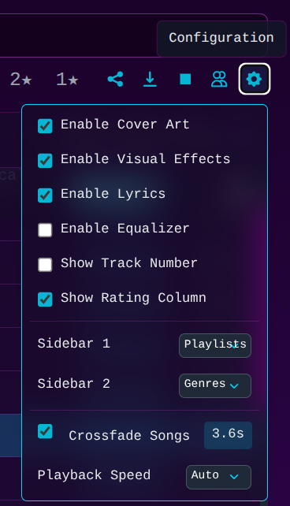
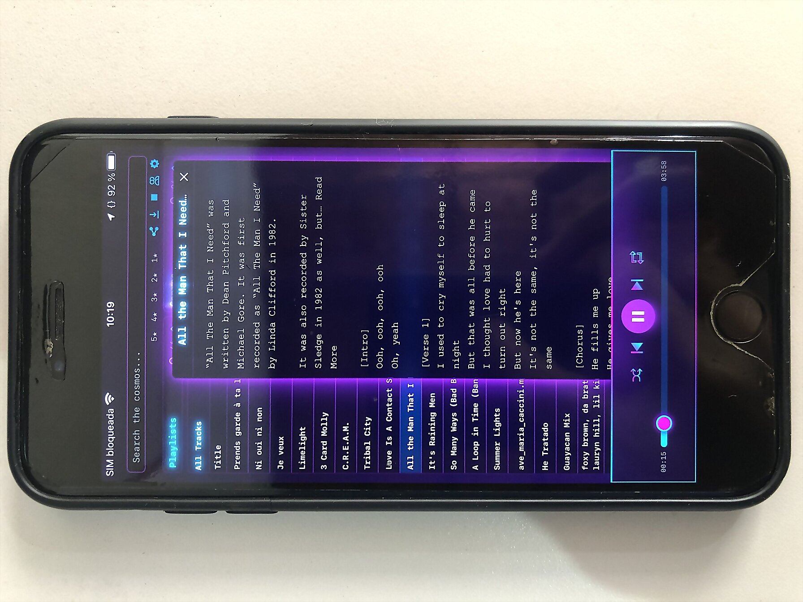
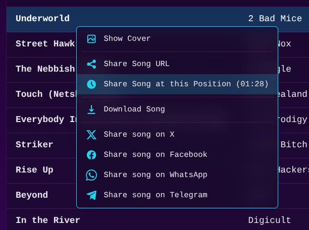

# Synthwave Player by Elive

> _Crafted with relentless dedication during three months of intensive, around-the-clock development, this player was passionately built to deliver a truly unparalleled, feature-rich listening experience._


Simply put, this is the **most enjoyable** music player ever made. It is not just a player, is a masterpiece.

This self-hosted, open-source web player streams your personal music collection with a stunning synthwave/retrowave aesthetic that transforms your listening experience. It converts your library into a private, distraction-free streaming service, putting you in complete control.

<!-- Intro Image -->
<a href="https://raw.githubusercontent.com/Elive/synthwave-player/refs/heads/main/media/synthwave-player-multiple-interfaces.webp" target="_blank">
    
</a>

<!-- Video Demo Placeholder -->
<!-- [](https://www.youtube.com/watch?v=YOUTUBE_VIDEO_ID_HERE "Synthwave Player - Video Demo") -->

<br clear="right">
<br clear="right">


**[➡️ LIVE DEMO](https://music.home.thanatermesis.org/?playlists=Royalty-Free&song=24350eb10ec99665d6444bb294983d2998e363a4&sort=rating%3Adesc&t=77)** - Experience the player directly

**[📜 Changelog](CHANGELOG.md)** - Follow our ongoing improvements and updates

---

## 🎧 A Sonic Universe Under Your Control


Tired of streaming services that dictate your listening experience, inject ads, and rent you access to music you thought you owned? The **Synthwave Player** is a declaration of musical independence. It's not a service; it's ***your*** **open-source server**, its your music, your curation, and your unstoppable power.

Built for the discerning music lover who curates their own library, this player combines the convenience of web access with the power of self-hosting. De-cloud yourself and own your listening experience, without limits.

<br clear="right">


### 🏆 Why This Self-Hosted Player Beats Spotify


For real music lovers, a self-hosted player isn't just a preference—it's a necessity. Here’s why streaming services fall short:

-   **👑 Your full control:** Your music, your rules. No subscriptions, ads, limits or surprises. With no tracking data collection.
-   **🎧 Your Personal Spotify, anywhere!:** Transform your music library into a private streaming service effortlessly. Get the Spotify experience with your own collection, no ads, no fees, no surprises, and complete privacy. - Is time to cancel your Spotify billing!
-   **🎨 Beautiful Design & Unique UX:** Music is a sensorial experience, this player gives you in a unique user experience designed to immerse you in the music with the sole purpose to enjoy it.
-   **🎤 Automated Lyrics:** Sing along with synchronized, auto-scrolling lyrics found automatically from multiple sources. A premium feature on other platforms, free and standard here.
-   **🎤 For Music Creators:** Use it as your Music website. Publish your works-in-progress or finished masterpieces directly, bypassing corporate gatekeepers. You control the distribution and own the rights.
-   **🔭 View-Based Tracklists:** Features a powerful view-based tracklist selection. Any view you create by filtering multiple genres, combining playlists, selected specific artists, or search results becomes a unique, perfectly shareable tracklist. This is a unique concept that never another music app had before.
-   **🔗 Unmatched Sharability:** Share not just songs, but *moments*. Send a link to a track that starts at the exact second you want, or share a link to your custom-filtered 5-star 80s rock playlist.
-   **🎵 The Unfindable Tracks:** Mainstream services lack deep cuts, rare imports, remixes, and many game OSTs, and often replace original albums with modern "remasters." Self-hosting preserves the authentic sound of the specific version you own—if you have the file, you can play it.
-   **👻 No Vanishing Music:** Tracks on streaming services can disappear overnight due to licensing issues. Your personal library is permanent.
-   **🔊 Uncompromised Audio Quality:** Stream your high-fidelity lossless files (like FLAC) without compromise or extra cost.
-   **🏷️ Your Curation and Metadata:** Tired of seeing your meticulously tagged "Retrowave" tracks in a generic "Electronic" category? You control the tags, genres, ratings, and cover art, building the perfectly organized library you've always wanted.

---

## ✨ Features

### 🎵 Core Playback & Audio Control
-   **Full-Featured Playback:** All the controls you expect: Play, Pause, Next, Previous, plus a dedicated **Stop** button to restart your picked selection.
-   **Intelligent `Previous` Button:** Restarts the current track if played briefly; otherwise, navigates to the actual previous song in your listening history.
-   **Advanced Shuffle & Repeat:** Three shuffle modes ("Off," "List" for a stable randomized queue, and "Random" for a new random song every time) and three repeat modes (Off, One, All).

-   **Playback Speed Control:** Adjust playback speed with pitch preservation, perfect for audiobooks or podcasts.
-   **Advanced Mouse Controls:** Use your mouse wheel over player elements to control the progress bar, volume, playback rate, and crossfade duration.


### 📚 Library Management & Organization
-   **Zero-Setup Rhythmbox Integration:** Automatically discovers and parses your existing `rhythmdb.xml` database, instantly loading all songs, metadata, ratings, and playlists (`.pls`, `.m3u`, `.m3u8`). It even stays in sync with your library changes. _(NOTE: Rhythmbox dependency will be removed in a future version for a standalone engine)._
-   **Powerful Filtering & Sorting:**
    - Create on-the-fly views by combining filters for **multiple genres**, **multiple playlists**, and **star ratings**.
    - Selections within a category (e.g., two Genres) act as an **OR** filter, while selections across categories (e.g., a Genre and an Artist) act as an **AND** filter.
    - `Alt+click` any sidebar item to select it exclusively.
    - Sort your music by title, artist, album, genre, rating, or duration with natural sorting that correctly handles numbers.
<p align="center">
    
</p>
-   **Fuzzy Search:**
    - Find any track, artist, or album with an as-you-type search that's tolerant of typos and partial words.
    - A relevance-based scoring algorithm heavily weights matches in the song title, followed by the artist and album, ensuring the most relevant results appear first.
<p align="center">
    
</p>

-   **Multi-select Filtering:** Select multiple artists or albums to create combined views. This works in conjunction with genre and playlist filters for powerful and precise tracklist curation.
<p align="center">
    
</p>

-   **Dynamic Sidebars:** The Artist and Album lists dynamically update to show only entries relevant to your current Genre or Playlist selection. Or change them to other selectors, and even run a personal search inside them for faster selection.
<p align="center">
    
</p>


### ✨ User Experience & Interface
-   **Stunning Synthwave & Retrowave UI:** A beautiful, responsive interface with a neon-style aesthetic, micro-animations, glossy cover art effects, and an animated header/footer.
-   **Dynamic Visualizer:** When a song with cover art plays, the album cover slides out to reveal a spinning vinyl disc with a subtle, cycling neon glow.

https://github.com/user-attachments/assets/c422dc7f-b973-452b-8cc1-ce991e1a2b6a

-   **Integrated Lyrics View:** View synchronized lyrics in a custom, retro-styled display. Lyrics auto-scroll with the music, and manual scrolling pauses the auto-scroll. A smart fetching engine finds lyrics from local cache, metadata, and multiple online providers, with real-time notifications when lyrics are found.
<p align="center">
    
</p>

-   **Powerful Context Menus:** Right-click on songs, playlists, or genres for quick access to actions like sharing, downloading, viewing cover art, and opening lists in a new tab.
-   **Download a liked song:** There's a direct download feature that will downlad the song on its full quality, metatags, and coverart images included.
<p align="center">
  
</p>

-   **UI Customization:** Toggle special columns, enable/disable visual effects for performance, enable/disable features, and configure sidebars to show the content you want (Playlists, Genres, Artists, Albums).
<p align="center">
  
</p>

-   **Interactive Onboarding:** A flying welcome message and an introductory modal greet first-time users, while animated "comet" hints guide discovery of new features.

### 📱 Mobile Experience & Features
-   **Fully Responsive Design:** A beautiful, adaptive interface that offers a seamless experience on any device, from desktops to smartphones.
-   **Lock Screen Controls:** Manage playback and view cover art directly from your phone's lock screen, with support for iOS and Android.
-   **Background Playback:** Keep the music going reliably even when the app is minimized or your screen is off.
-   **Optimized for Performance:** Features like the equalizer and crossfade are disabled on mobile to ensure a smooth, lightweight experience without draining your battery.
-   **One-Handed Usability:** The layout is designed for intuitive one-handed use on smaller screens, making it easy to navigate your library on the go.
-   **Standalone App:** Add it to your home screen for quick access, and it behaves like a native app without browser UI elements.
<p align="center">
  
  
</p>
<p align="center">
  
  
</p>
<p align="center">
  
  
</p>

### 🔗 Sharing & Connectivity
-   **Hyper-Specific Sharing:** Share a direct link to a song, a song starting at a specific **timestamp**, or a complex custom view combining playlists, genres, ratings, sorting, and even search queries. Includes one-click sharing to social media.
<p align="center">
  
</p>

-   **Internet Radio & Stream Support:** Add and play live internet radio streams from file playlists alongside your local music.
<p align="center">
  
</p>

-   **Automatic Network Configuration:** Built-in **UPnP** support automatically configures port forwarding on your router, making your music accessible from the internet with zero hassle.
-   **Friends' Music Links:** Curate and display a list of links to your friends' Synthwave Player servers, accessible directly from the main menu.
<p align="center">
  
</p>

### 🚀 System, Performance & Security
-   **High-Performance & Lightweight:** Built on a non-blocking asynchronous architecture, the server handles hundreds of simultaneous streams with minimal resource usage (as little as 50MB of RAM). It scales to massive libraries by intelligently loading and rendering songs in batches.
<p align="center">
  
</p>

<!-- TODO FIXME -->
<p align="center">
  <video src="media/synthwave-player-server-settings.mp4" width="80%" autoplay loop muted playsinline alt="Synthwave Player Server Settings"></video>
</p>


-   **Private & Secure:** As a self-hosted application, there is no tracking or third-party data collection. It features a secure, local-network-only **Admin Mode** with password protection and brute-force rate limiting. All file access is hardened against path traversal attacks.
<p align="center">
  
  
</p>

-   **System Intelligence:**
    - The server automatically checks for new versions and notifies you with a detailed changelog.
    - On startup, it verifies that all system dependencies are present and that its network port is free, preventing common setup issues.
-   **Real-time WebSocket Sync:** The UI stays perfectly in sync with the server, providing instant notifications for library updates, configuration changes, and newly found lyrics without needing to reload the page.
<p align="center">
  
</p>

---

## Download / Install

**NOTE:** If you just want to try the player 🚀 the quickest method is to simply download **[Elive Retrowave](https://www.elivecd.org/download/retrowave)** which ships with the player already pre-installed, configured, and with music ready to use.

<details>
<summary>
        <strong>Easy Installation</strong>
    </summary>

Go to the *Releases* section and download the latest `.deb` package for your system.


</details>

<details>
<summary>
        <strong>Manual Installation</strong>
        
    </summary>
### Installation

1.  **Clone the repository**:

2.  **Install the required Perl modules.**

    You can use `cpanm` (you might need to install it first, e.g., `sudo apt-get install cpanminus`):
    ```bash
    sudo cpanm Mojolicious Net::UPnP XML::LibXML MP3::Tag File::HomeDir Digest::SHA Try::Tiny
    ```

    **Alternatively, for Debian 13 (Trixie) and derivatives:**
    You can install most dependencies directly from the system's package manager, which is often faster and better integrated.
    ```bash
    sudo apt-get update
    sudo apt-get install libmojolicious-perl libnet-upnp-perl libxml-libxml-perl libmp3-tag-perl libfile-homedir-perl libdigest-sha-perl libtry-tiny-perl
    ```

3.  **Make the script executable:**
    ```bash
    chmod +x synthwave-player
    ```

### Running the Server
There are several ways to run the player. For initial testing, it's best to run it in the foreground to watch for logs and errors.

**1. Foreground Mode (for testing)**
To see live log output, run the server in the foreground. It will run until you stop it with `Ctrl+C`.
```bash
hypnotoad --foreground synthwave-player
```

**2. Background Daemon Mode**
To start the player and have it run in the background, detached from your terminal:
```bash
hypnotoad synthwave-player
```
To stop the background server:
```bash
hypnotoad --stop synthwave-player
```

### Accessing the Player
Open your web browser and navigate to `http://<your-server-ip>:8160` as it explains on the terminal logs. If running on your local machine, you can simply use `http://localhost:8160` or `http://127.0.0.1:8160`.

#### 📱 Using as a Desktop App
For a more integrated desktop experience, you can run the player in its own window without browser toolbars. This makes it feel like a native application.

Replace the URL with your player's actual address. For local use, this is `http://localhost:8160`. If accessing over the network or internet, use your server's IP or domain name (e.g., `https://music.yourdomain.com`).

*   **Google Chrome / Chromium:**
    ```bash
    google-chrome --app="http://localhost:8160"
    ```
*   **Mozilla Firefox:**
    Firefox has a Site-Specific Browser (SSB) mode which can be launched via the terminal:
    ```bash
    firefox --ssb "http://localhost:8160"
    ```
*   **Surf (Minimalist Browser):**
    For an extremely lightweight option, you can use `surf`. IMPORTANT: depending on the version and your system's webkit libraries, you may encounter rendering or audio playback issues.
    ```bash
    surf "http://localhost:8160"
    ```
</details>

<details>
<summary>
        <strong>🌐 How to Self-Host your music library for Online Access</strong>
        
    </summary>
<br>
While you can access the player by its IP address on your local network, setting it up with a domain name, a reverse proxy, and SSL encryption provides a more professional, secure, and convenient experience. Here’s a complete guide for setting this up on a Debian 13 (Trixie) server.

> **🚀 Pro Tip for Servers:** If you're setting this up on a dedicated server, consider using **[Elive for Servers](https://www.elivecd.org/premium/elive-for-servers/)**. It's a tool that enhances your existing Debian/Ubuntu server with the amazing Elive shell, automated TMUX sessions, and optional installers for a highly optimized Nginx, security tools (like Fail2ban), and more. It can automate much of the setup below in just a few minutes.

---

#### Step 1: Get a Domain Name & Point it to Your Server

You need a domain or subdomain pointed to your server's public IP address.

**If you have a dynamic IP address** (common for home connections), you can use a free dynamic DNS service.
1.  Sign up at a service like [freedns.afraid.org](https://freedns.afraid.org/).
2.  Create a subdomain (e.g., `my-music.us.to`).
3.  They will provide you with a unique URL to update your IP. Set up a cron job to run every 5 minutes to keep your IP updated.
    -   Open your crontab: `crontab -e`
    -   Add this line, replacing the URL with your unique one:
        ```bash
        */5 * * * * curl -s "https://freedns.afraid.org/dynamic/update.php?YOUR_UNIQUE_TOKEN_HERE" > /dev/null 2>&1
        ```

#### Step 2: Install and Configure Nginx with SSL

Nginx will act as a reverse proxy, securely forwarding traffic from the standard web port (443) to the player application (running on port 8160). This guide also covers setting up a free SSL certificate from Let's Encrypt.

1.  **Install Nginx and Certbot:**
    ```bash
    sudo apt-get update && sudo apt-get install nginx certbot
    ```

2.  **Create an Nginx configuration file** for your site. Replace `music.yourdomain.com` with your actual domain.
    ```bash
    sudo nano /etc/nginx/sites-available/music.yourdomain.com
    ```

3.  **Paste this configuration into the file.** It sets up an SSL-secured reverse proxy that redirects all HTTP traffic to HTTPS and enables WebSocket support.
    ```nginx
    # Redirect all HTTP traffic to HTTPS
    server {
        listen 80;
        server_name music.yourdomain.com;

        location / {
            return 301 https://$host$request_uri;
        }
    }

    # Serve the application over HTTPS
    server {
        listen 443 ssl http2;
        server_name music.yourdomain.com;

        # These paths are managed by Certbot. Make sure they exist after running certbot.
        ssl_certificate /etc/letsencrypt/live/music.yourdomain.com/fullchain.pem;
        ssl_certificate_key /etc/letsencrypt/live/music.yourdomain.com/privkey.pem;

        # Recommended SSL settings from Certbot/Mozilla.
        include /etc/letsencrypt/options-ssl-nginx.conf;
        ssl_dhparam /etc/letsencrypt/ssl-dhparams.pem;

        location / {
            # Forward requests to your Perl application
            proxy_pass http://127.0.0.1:8160;

            # Set headers for WebSocket support and to pass client info
            proxy_http_version 1.1;
            proxy_set_header Upgrade $http_upgrade;
            proxy_set_header Connection "upgrade";
            proxy_set_header Host $host;
            proxy_set_header X-Real-IP $remote_addr;
            proxy_set_header X-Forwarded-For $proxy_add_x_forwarded_for;
            proxy_set_header X-Forwarded-Proto $scheme;
        }
    }
    ```

4.  **Enable the new site:**
    ```bash
    sudo ln -s /etc/nginx/sites-available/music.yourdomain.com /etc/nginx/sites-enabled/
    ```

5.  **Obtain the SSL Certificate.** You must have Nginx stopped for Certbot's `standalone` mode to work.
    ```bash
    sudo systemctl stop nginx
    sudo certbot certonly --standalone -d music.yourdomain.com
    ```
    Certbot will automatically set up a cron job to renew the certificate.

6.  **Generate a strong Diffie-Hellman group** for added security.
    ```bash
    sudo openssl dhparam -out /etc/letsencrypt/ssl-dhparams.pem 2048
    ```

7.  **Test the configuration and start Nginx:**
    ```bash
    sudo nginx -t
    ```
    If the test is successful, start Nginx:
    ```bash
    sudo systemctl start nginx
    ```
    Your server is now configured! You can access your music securely at `https://music.yourdomain.com`.

#### Step 3: Make the Player Run Persistently

To ensure the player starts on boot and runs continuously, you can use a cron job or a `systemd` service. The `systemd` method is more robust as it can automatically restart the player if it crashes.

**Option A: Auto-start with Cron (Simple)**

A cron job can start the player at boot. This is easy to set up but won't restart a crashed server.

1.  Open your user's crontab for editing:
    ```bash
    crontab -e
    ```

2.  Add the following line, making sure to use the absolute path to the script.
    ```bash
    @reboot hypnotoad /home/your_username/path/to/music-player/synthwave-player
    ```

**Option B: Run as a Systemd Service (Recommended)**

This is the most reliable way to run the player as a long-term service. The player comes with a pre-configured `systemd` user service.

1.  **Enable user lingering:**
    To ensure the server runs even when you are not logged in, you must enable lingering for your user account. Replace `your_username` with your actual username.
    ```bash
    sudo loginctl enable-linger your_username
    ```

2.  **Enable and start the service:**
    To start the server immediately and have it automatically start on every boot, run the following command (as your user, not root):
    ```bash
    systemctl --user enable --now synthwave-player-server.service
    ```

3.  **Check the service status:**
    You can verify that the service is running correctly with:
    ```bash
    systemctl --user status synthwave-player-server.service
    ```
Your server is now fully configured! You can access your music securely at `https://music.yourdomain.com`.


<strong>🍓 How to build a music server on a Raspberry Pi</strong>
<br>
A Raspberry Pi is an excellent choice for a low-power, energy-efficient, and always-on music server. Since Raspberry Pi OS is based on Debian, you can follow the main installation instructions.

The only specific consideration for a Raspberry Pi is the location of your music library. If you store your music on an external USB drive, you will need to edit the `@MUSIC_DIRECTORIES` variable from the tool, personal configurations, or interface configurations to include the path to your drive (e.g., `/media/pi/MyMusicDrive`).
</details>

---

## 💎 PRO / Premium Version

For users who want to take their experience to the next level, the **Synthwave Player PRO** offers exclusive features and capabilities not found in the standard version. Upgrading to PRO is also a great way to support the continued development of this project.

**Exclusive PRO Features:**
-   **Advanced Audio Processing:** Unlock additional audio enhancements and professional-grade effects.
-   **Multi-user Profiles:** Create separate profiles for different users, each with their own settings, playlists, and statistics.
-   **10-Band Audio Equalizer:** Shape your sound with a 10-band EQ, preamp, bass boost, and stereo width controls. Save your settings as custom presets and toggle them on the fly.
<p align="center">
  
</p>

#### Future ideas to implement for the PRO version
-   **AI-Powered Lyric Repair:** High-quality lyrics, repairing the text using AI.
-   **Smart Playlist Generation:** Automatically create playlists based on your listening habits, mood, or specific criteria.

---

## Future Plans

Some ideas / TODO to implement:

-   **Internationalization (i18n):** Full translation into multiple languages using gettext, with browser-based auto-detection and a manual language selector.
-   **Video Player:** A companion video player with a similar synthwave aesthetic and feature set, including animated thumbnails.
-   **Peer-to-Peer Sharing:** Build shareable music libraries with friends over peer-to-peer connections, directly integrated with yours!
-   **User Authentication:** Optional username/password protection to restrict access to your player.
-   **User Statistics:** Track listening habits and see stats on a per-user basis.
-   **User-based liked system**: Allow users to like (hearth) the songs, saving them in ther username login, and display the total ratings average too.
-   **Windows / MacOS / Docker Support:** Set up this player running it from a docker so you can install it on windows or mac too.
-   **UI**: The disc should not spin, but instead it should remain in place and rotate a few pixels back and forth to simulate the record spinning. This will require to separate the reflection with the disc image (2 images), the disc should spin and the reflection should whobble back-and-forth


---

## 💝 Supporting the Project

If you enjoy using the Elive Synthwave Player, consider:

* Starring the repository on GitHub

* Share it with others

* Supporting Elive Linux development
